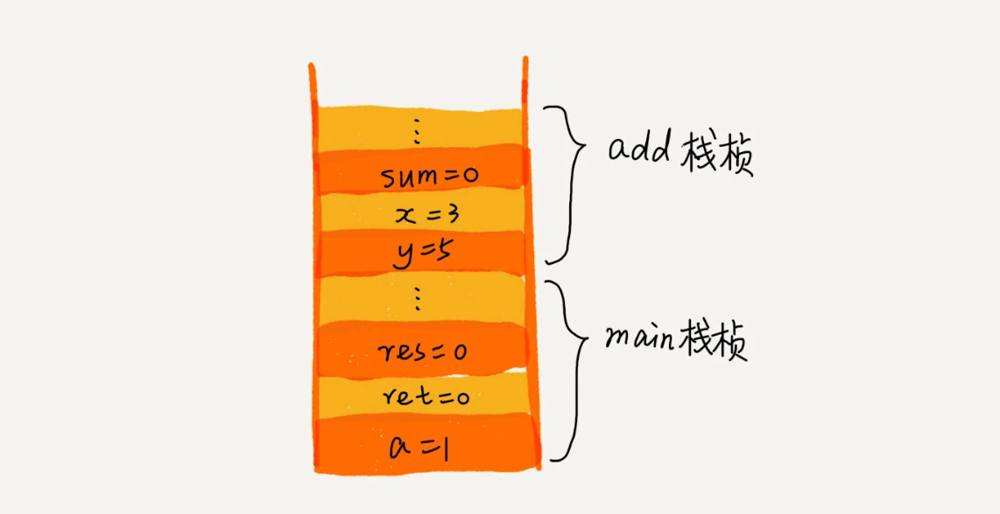

# 栈

## 特性

1. 先进后出
2. 只允许在一端插入和删除数据 （“操作受限”的线性表）

## 实现

### 数组实现-顺序栈

```typescript
class ArrayStack {
  #items = [] // 数组
  #n = 0  // 栈大小限定
  #count;
  constructor (n) {
    this.#n = n
    this.#count = 0
  }
  push (item: string) {
    if (this.#count === this.#n) return false
    this.items[this.#count] = item
    this.#count++
    return true
  }
  pop () {
    if (this.#count === 0) return null
    const temp = this.items[this.#count]
    this.#count--
    return temp
  }
}
```

### 链表实现-链式栈

## 应用

### 函数

函数调用示例

```
int main() {
   int a = 1; 
   int ret = 0;
   int res = 0;
   ret = add(3, 5);
   res = a + ret;
   printf("%d", res);
   reuturn 0;
}

int add(int x, int y) {
   int sum = 0;
   sum = x + y;
   return sum;
}
```



### 数学运算

1. 一个栈存数据，另一个栈存操作符；
2. 运算符与运算符栈顶的元素优先级比较
   1. 当前运算符 > 栈顶元素，当前运算符入栈；
   2. 当前运算符 <= 栈顶元素，取出栈顶运算符，进行计算，再把计算完的结果亚茹操作数栈，继续比较。

### 括号匹配

## get

空间复杂度指的是除了原本的数据存储空间外，算法运行还需要额外的存储空间。

# TODO

括号匹配

# ？

**函数调用为何使用栈**
从调用函数进入被调用函数，对于数据来说，变化的是什么呢？是作用域。所以根本上，只要能保证每进入一个新的函数，都是一个新的作用域就可以。而要实现这个，用栈就非常方便。在进入被调用函数的时候，分配一段栈空间给这个函数的变量，在函数结束的时候，将栈顶复位，正好回到调用函数的作用域内。  
历史记录
a -> b -> c
c -> b -> a
a -click-> b
操作不是前进后退时，清空y栈
